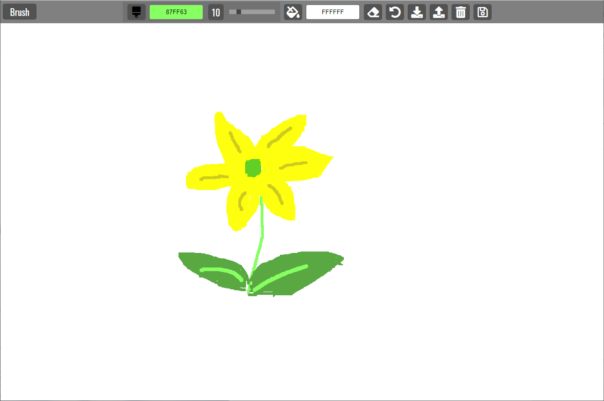

# Paint

## About

A web-based app uses Canvas HTML elements allowing users to create a basic version of Microsoft Paint. It supports several storage options: save to, load from, and clear local storage, as well as save as an image file.
